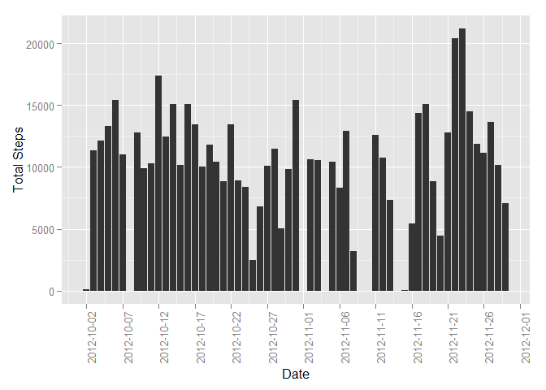
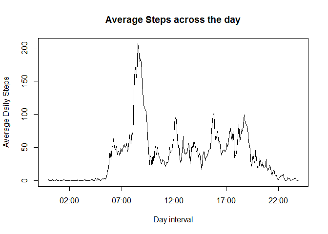
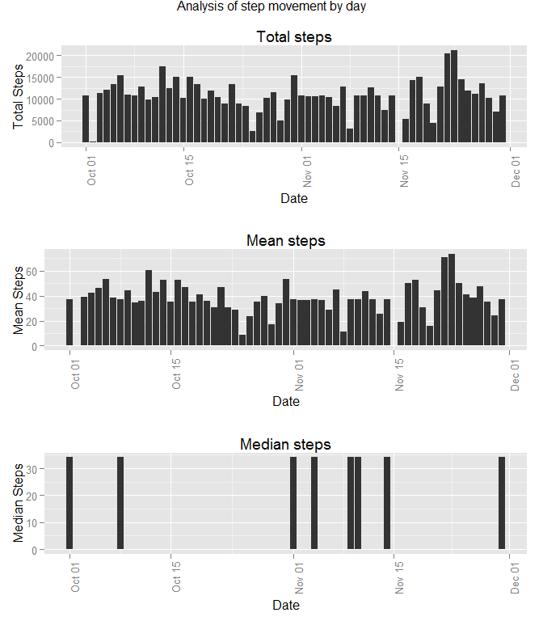
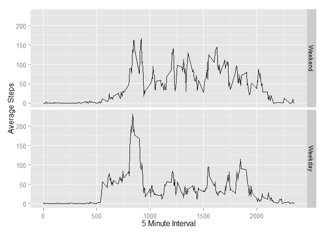

# Reproducible Research Peer Assessment 1
Alan C Bonnici  
Friday, August 08, 2014  

Activity Monitoring Data Analysis
=================================

What follows is a data analysis of an activity monitoring device. The data are data collected by an activity monitoring device worn by an anonymous individual. The data was collected at 5 minute intervals through out the day during the months of October and November 2012. Included is the number of steps taken in each 5 minute interval.


```r
# create the directory if it does not exists. 
if (!file.exists("./data")) {
    dir.create("./data")
}

zipFileNm <- "./data/activity.zip"
dLoadFileNm <- "./data/sourceDt.RData"

# if the zip file does not exist download the file
if (!file.exists(zipFileNm)) {
    # this file stores the date when the archive was downloaded
    
    url <- "https://d396qusza40orc.cloudfront.net/repdata%2Fdata%2Factivity.zip"
    download.file(url, destfile = zipFileNm)
    
    # extract the archive
    unzip(zipFileNm, overwrite=TRUE, exdir="./data")
    
    # update the date the file was downloaded
    downloadDtTm <- format(Sys.time(), "%b %d %Y at %H:%M:%S")
    save(downloadDtTm, file = dLoadFileNm)        
} else {
    load(dLoadFileNm, envir=environment())    
}
```

## Loading and preprocessing the data

The data was downloaded from the url https://d396qusza40orc.cloudfront.net/repdata%2Fdata%2Factivity.zip. It was downloaded on **Aug 08 2014 at 16:46:10**. 


```r
data <- read.csv("./data/activity.csv", header = TRUE)

# Convert the data field to a date
data$date <- as.Date(as.character(data$date), format="%Y-%m-%d")
```

The read data consists of 17568 rows and 3 columns. The column names are **steps, date, interval** and their respective class is **integer, Date, integer**.


```r
# Install and load libraries used here
for (x in c("ggplot2", "plyr", "grid", "gridExtra")) {
    if (x %in% rownames(installed.packages()) == FALSE) {
        install.packages(x)
        }
    }
require(ggplot2)
```

```
## Loading required package: ggplot2
```

```r
require(grid)
```

```
## Loading required package: grid
```

```r
require(gridExtra)
```

```
## Loading required package: gridExtra
```

```r
require(plyr)
```

```
## Loading required package: plyr
```

## What is mean total number of steps taken per day?

```r
data1 <- data[complete.cases(data$steps),1:2]
plot1Data <- ddply(data1, .(date), summarize, totSteps = sum(steps))
p <- ggplot(plot1Data, aes(x=date, y = totSteps))
p <- p + geom_histogram(stat="identity")
p <- p + ylab("Total Steps") + xlab("Date")
p <- p + theme(axis.text.x = element_text(angle = 90, hjust = 1))
p <- p + scale_x_date(breaks = "5 days")
p
```

 

The mean of the total number of steps per day is **``10766``**.
The median of the total number of steps per day is **``10765``**.

##What is the average daily activity pattern?

```r
data2 <- data[complete.cases(data$steps),c(1,3)]
plot2Data <- ddply(data2, .(interval), summarize, avgSteps = mean(steps))

# Format the interval so that it is present as a time
plot2Data$interval <- sprintf("%04d", plot2Data$interval)
plot2Data$interval <- strptime(paste0(substr(plot2Data$interval, 1, 2), ":", substr(plot2Data$interval, 3, 4)), "%H:%M")
plot(plot2Data$interval, plot2Data$avgSteps, type="l", 
     xlab="Day interval", 
     ylab="Average Daily Steps", 
     main="Average Steps across the day")
```

 

The 5-minute interval, on average across all the days with the largest number of steps occurs at ***``08:35``***.

##Inputing missing values


```r
# The number of rows with NA values can be computed by subtracting all the read
# rows from the number of complete cases computed for earlier parts of this
# solution.
missingVals <- nrow(data) - nrow(data1)
```

The number of missing values in the data is **``2304``**.


```r
# copy the dataset to a new one
filledData <- data

# Get the intervals that contain NA
intervalNA <- unique(filledData$interval[is.na(filledData$steps)])
for (x in intervalNA) {
    calcMean <- mean(filledData$steps[filledData$interval == x], na.rm=TRUE)
    filledData$steps[filledData$interval == x & is.na(filledData$steps)] <- calcMean
}
```


```r
plot3Data <- ddply(filledData, .(date), summarize, 
                   totSteps = sum(steps), 
                   meanSteps = mean(steps), 
                   medianSteps = median(steps))
p1 <- ggplot(plot3Data, aes(x=date, y = totSteps))
p1 <- p1 + geom_histogram(stat="identity")
p1 <- p1 + ylab("Total Steps") + xlab("Date") + ggtitle("Total steps")
p1 <- p1 + theme(axis.text.x = element_text(angle = 90, hjust = 1))

p2 <- ggplot(plot3Data, aes(x=date, y = meanSteps))
p2 <- p2 + geom_histogram(stat="identity")
p2 <- p2 + ylab("Mean Steps") + xlab("Date") + ggtitle("Mean steps")
p2 <- p2 + theme(axis.text.x = element_text(angle = 90, hjust = 1))

p3 <- ggplot(plot3Data, aes(x=date, y = medianSteps))
p3 <- p3 + geom_histogram(stat="identity")
p3 <- p3 + ylab("Median Steps") + xlab("Date") + ggtitle("Median steps")
p3 <- p3 + theme(axis.text.x = element_text(angle = 90, hjust = 1))

grid.arrange(p1, p2, p3, nrow = 3, main = "Analysis of step movement by day")
```

 

The charts above where generated from the data below:


```r
plot3Data
```

```
##          date totSteps meanSteps medianSteps
## 1  2012-10-01    10766   37.3826       34.11
## 2  2012-10-02      126    0.4375        0.00
## 3  2012-10-03    11352   39.4167        0.00
## 4  2012-10-04    12116   42.0694        0.00
## 5  2012-10-05    13294   46.1597        0.00
## 6  2012-10-06    15420   53.5417        0.00
## 7  2012-10-07    11015   38.2465        0.00
## 8  2012-10-08    10766   37.3826       34.11
## 9  2012-10-09    12811   44.4826        0.00
## 10 2012-10-10     9900   34.3750        0.00
## 11 2012-10-11    10304   35.7778        0.00
## 12 2012-10-12    17382   60.3542        0.00
## 13 2012-10-13    12426   43.1458        0.00
## 14 2012-10-14    15098   52.4236        0.00
## 15 2012-10-15    10139   35.2049        0.00
## 16 2012-10-16    15084   52.3750        0.00
## 17 2012-10-17    13452   46.7083        0.00
## 18 2012-10-18    10056   34.9167        0.00
## 19 2012-10-19    11829   41.0729        0.00
## 20 2012-10-20    10395   36.0938        0.00
## 21 2012-10-21     8821   30.6285        0.00
## 22 2012-10-22    13460   46.7361        0.00
## 23 2012-10-23     8918   30.9653        0.00
## 24 2012-10-24     8355   29.0104        0.00
## 25 2012-10-25     2492    8.6528        0.00
## 26 2012-10-26     6778   23.5347        0.00
## 27 2012-10-27    10119   35.1354        0.00
## 28 2012-10-28    11458   39.7847        0.00
## 29 2012-10-29     5018   17.4236        0.00
## 30 2012-10-30     9819   34.0938        0.00
## 31 2012-10-31    15414   53.5208        0.00
## 32 2012-11-01    10766   37.3826       34.11
## 33 2012-11-02    10600   36.8056        0.00
## 34 2012-11-03    10571   36.7049        0.00
## 35 2012-11-04    10766   37.3826       34.11
## 36 2012-11-05    10439   36.2465        0.00
## 37 2012-11-06     8334   28.9375        0.00
## 38 2012-11-07    12883   44.7326        0.00
## 39 2012-11-08     3219   11.1771        0.00
## 40 2012-11-09    10766   37.3826       34.11
## 41 2012-11-10    10766   37.3826       34.11
## 42 2012-11-11    12608   43.7778        0.00
## 43 2012-11-12    10765   37.3785        0.00
## 44 2012-11-13     7336   25.4722        0.00
## 45 2012-11-14    10766   37.3826       34.11
## 46 2012-11-15       41    0.1424        0.00
## 47 2012-11-16     5441   18.8924        0.00
## 48 2012-11-17    14339   49.7882        0.00
## 49 2012-11-18    15110   52.4653        0.00
## 50 2012-11-19     8841   30.6979        0.00
## 51 2012-11-20     4472   15.5278        0.00
## 52 2012-11-21    12787   44.3993        0.00
## 53 2012-11-22    20427   70.9271        0.00
## 54 2012-11-23    21194   73.5903        0.00
## 55 2012-11-24    14478   50.2708        0.00
## 56 2012-11-25    11834   41.0903        0.00
## 57 2012-11-26    11162   38.7569        0.00
## 58 2012-11-27    13646   47.3819        0.00
## 59 2012-11-28    10183   35.3576        0.00
## 60 2012-11-29     7047   24.4688        0.00
## 61 2012-11-30    10766   37.3826       34.11
```

##Are there differences in activity patterns between weekdays and weekends?


```r
# Indicate whether date is a week day or week end
filledData$dayType <- ifelse(weekdays(filledData$date) %in% c("Saturday", "Sunday"), 0, 1)

# and convert it into a factor
filledData$dayType <- factor(filledData$dayType, labels=c('Weekend', "Weekday"))

plot4Data <- ddply(filledData, .(interval, dayType), summarize, avgSteps = mean(steps))
ggplot(plot4Data, aes(x=interval, y = avgSteps)) +
    facet_grid(facets=(dayType ~ .)) +
    geom_line() + 
    xlab("5 Minute Interval") +
    ylab("Average Steps")
```

 

